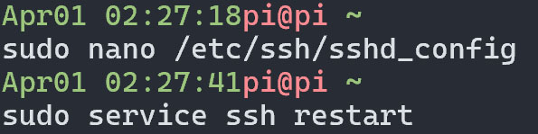

# Establish a VPN through SSH from Windows client
## Introduction
I recently found[^1] that we can use SSH's built-in function(utilized from the client side with a `-D` option, as in `ssh -D 10800 server`) to establish a VPN to home network, which can hugely simplify the setup, and has a lot of advantages such as security, and it helps masquerading our traffic from the outside network(for example, to against censorship).

In my case, server is Linux(actually a raspberry pi running 24x7), client is Windows 10. If you prefer a Linux client, I'd recommend you consult [^1].

This article is a detailed(somewhat tedious) discussion of the usage scenario. For a quick demonstration, skip ahead to the [video demo](#video-demo) and [steps to connect the VPN](#steps-to-connect-the-vpn).
## Topology of my home network
I've got a typical home network as most users: devices all connected to a router, in subnet 192.168.31.0/24. Their IP addresses in the picture are fabricated, for demonstration only.

## Connecting SSH thru mobile hotspot
Outside home, I connect the Windows laptop to the SSH of my raspberry pi thru mobile phone's hotspot(also can use wifi of hotel/workplace etc.).

## Logical connection of the VPN
After establishing VPN, the logical topology looks like below, the laptop seems connected directly to the home router(as if the laptop is still inside home network). 

But actually all the traffic from the client laptop to the devices of my home network, is thru raspberry pi, as in [the previous pic](#connecting-ssh-thru-mobile-hotspot).

## Video demo
## Steps to connect the VPN
These are the simplified steps, if you fail in any step, before submit an issue / comment, please read thru the [prerequisites](#prerequisites).

All the following steps are invoked on the Windows client.
1. Connecting SSH
  > ssh -D 10800 piddns

  
  - `10800` is a port number, SSH client will open this port on the Windows client, to accept socks5 traffic, any traffic flowed thru this port, will be automagically forwarded between the client machine and the devices reachable by the Linux server. You can choose freely within 1024-65535 roughly, if it warns you that the port is in use, just change to another one. And you need to fill in this port number to SSTap's configuration in later steps.
  - `piddns` is a service name defined in my ssh client config file, see [this](#ssh-client-config) for reference. You can also use tedious form like `ssh -D 10800 username@sample.ddns.net -p 22222 -i /path/to/id_rsa` if you prefer.
2. On SSTap, add a proxy server as follows. Select `Type` as `SOCKS 5`, `Server IP` as `localhost` or `127.0.0.1`, `Port` fill in the same port number you entered previously in the `ssh -D` option, and leave other options as is. 
  
  - These info help SSTap to create a TUN device with the destination specified.
  
3. On SSTap, add a rule as follows. Choose names as you wish, `Proxify DNS request` select `Proxify`, `Action type` as `Proxify`, and in the `Rules list` fill in `192.168.31.0/24`, if your subnet is different, such as `192.168.0.0/24` or `192.168.1.0/24` used by many router by default, change the value of this field accordingly. 
  
  - These info help SSTap create routing table entry that says `192.168.31.0/24` goes to the TUN device created.
  
4. On SSTap, click `CONNECT`, wait a few seconds until the SSTap window minimized, off you go. Now you can access the services like you're at home, the experience depends on both sides' upload & download speed, of course.

## Prerequisites
- Your home network needs a public IPv4 DYNAMIC address that's __not__ under any type of NAT. 
  - While STATIC public address usually costs a lot more money(and I don't recommend this, since when a hacker do a netscan and find your open IP/port pair, he will have plenty of time trying to break thru your router and SSH service), DYNAMIC address is enough, you can utilize DDNS to bind a static domain name to it(remember don't share this domain name to anyone, it's functionally identical to a STATIC address to hackers).
  - Some ISPs may give your router a WAN IP that's under NAT by default(you can imagine that your network is under some other router/s managed by the ISP, which you certainly don't have access to it's configuration interface, so you can't do port-forwading setup). It is said that hopefully you can apply for an unNAT address from the ISP with no charge, please consult the ISP in use, and good luck. If still can't get unNAT address, we have other options, such utilize some cloud vps(which has unNAT address) with low cost, to do the relay, but this is out of the descussion of this article, if you're interested, leave a comment.
  - We don't discuss IPv6 here, since a lot of entry-level routers still don't provide the so-called `firewall` function of IPv6, so you can't allow access of your home devices from outside of home network. And if it has such functionality(usually as a single on-off switch), may open up the whole network to public access, then you can just access each devices thru their own IPv6 address, and no need for the VPN in discussion. Furthermore, IPv6 in my opinion is less secured than IPv4, because we need to secure every service of every device, which is a very complex and time-consuming project than relying on some router device's IPv4 NAT(so if the hacker can't break thru the router, he can't access the devices behind the router directly). 
- (Optional)Setup DDNS for it. If you haven't done yet, try [noip](https://www.noip.com/) to setup a domain name in no charge.
- Configure port forwarding for the SSH service of the running Linux server(in my case it's a raspberry pi) on router. Different routers have different configuration interface, please consult your device's manual. 
- (Optional)Add ip/hostname pairs in `C:\Windows\System32\drivers\etc\hosts` or setup a customized DNS service(more complex but more suitable for larger networks, for simple ones, just modify `hosts` file), see [this article](https://www.hostinger.com/tutorials/how-to-edit-hosts-file#Change_the_File_Manually) if you don't know how. Since the normal host resolution inside a LAN is unlikely working this VPN, writing down the hostnames in `hosts` file will simplify your access by typing in hostnames instead of IP addresses. 
- Some trivial config to the sshd service on the Linux server side(in my case, it's a raspberry pi), to avoid it dropping client connections too soon. Copy the following lines to the end of `/etc/ssh/sshd_config` file, and do a `sudo service ssh restart`, then reconnect the SSH client to make the modifications take effect.
  ```
  TCPKeepAlive yes
  ClientAliveInterval 120
  ClientAliveCountMax 720
  ```
  
- <a name="ssh-client-config"></a>(Optional)On the client PC, create / modify the ssh config file(located `%UserProfile%\.ssh\config` in Windows), for easier one-word login. See [How to Manage an SSH Config File in Windows and Linux](https://www.howtogeek.com/devops/how-to-manage-an-ssh-config-file-in-windows-linux/) for reference.
- For a Windows client(a laptop which I use to connect back to home network from outside via Internet), install [SSTap](https://sourceforge.net/projects/sstap/)(there may be many alternatives). 

## Pros
### Convenience
- Nearly zero-configuration is needed, compared to the VPN service of proprietary network devices, or other equivalent software services. Even Windows VPN client configuration by itself is unfriendly to new users, as an example, those diverse combinations of different encryption options is much a headache to get familiar with.
- Only one port needs to be forwarded. As a comparison, previously if I don't want to spend the time setup a standard VPN service, I have to port-forward every service that I need to access out of home. 
  - Furthermore, some services can't be easily changed to different ports other than the default one(there maybe limitations on both/either side of the server/client, e.g. Windows file sharing service), hence it's impossible to port-forward same services from different devices, and many well known ports may be banned by the network infrastructure. But `ssh` we used here has no such limitation, you can port forward it to any unused port freely.

### Security
- All traffic is encrypted thru SSH. The encryption of SSH should be trustworthy, otherwise it won't be the de-facto standard of connecting Linux terminals. So we don't need to worry about if there're any services in use that are unencrypted or easily deciphered.
- Key pairs are far more secured than passwords, do not use passwords for any of your SSH account, use different key for different account, change key pairs for each account frequently.
- Masquerade the traffic. Since even the most stringent Internet censorship system still needs to allow SSH protocol to pass thru, to ensure fundamental network management and operation. Standard VPN is known to behave very bad to this concern, since it usually uses standardized port number and has identifiable pattern, so tend to be easily banned by the censorship agency(e.g. some governments forbid personal vpn usage).
- There are a lot of NAS / software routers that provide Internet accessing features. But either they look too complicated, different from one to another, or I'm not very confident about their security & loyalty(since a lot of them are provided in binary form by enthusiasts, though open source software, but I can't figure out if they are modified for some purpose). And just as an example, in the field of file management, I don't quite anticipate such a third-party(as in the position of Windows OS) interface(usually browser based) can be very user friendly, compared to the Windows file sharing service we are so familiar with, which we can access a very large file on-the-fly without downloading the whole file first(such as watching a video).

## Cons / Todo
- UDP is unsupported in my setup. Since I've already logged in a rasbperry pi's terminal thru SSH, I can issue commands that rely on UDP there(such as ping devices, `wake on lan` devices, etc.), so there's no immediate need for me to get UDP up and running. Later if the need arises, I'll delve into it.
- This setup is untested against unstable networks, so I'm not sure what it will behave when underlying network connection is intermittent. Later I'd do some research on recovering vpn connection automatically(such as trying `autossh`).
- As security concerns mentioned in [conclusions](#conclusions), we need to know how to disable the `-D` function from within SSH service, to make sure when we don't need this feature, others(especially hackers) can't utilize it at the same time.

## Conclusions
This example shows that any device(even without root permission) in our home network can be easily used as a trojan horse, thru SSH, a standard service that most Linux servers will install(although nowadays most users tend to secure SSH thru private key pairs, still there're many people use simple passwords which are very easily guessed by brutal force attack), not to mention that hackers may use a lot more well tailored tools to control your network/devices.

So it's never over emphasized to make sure you followed Internet security best practices.

## References
[^1]:[基于ssh tunnel建立vpn - 听风小筑](https://lisongmin.github.io/os-systemd-ssh-vpn/)(I got to know `ssh -D` from this article, so the SSH server/client in this article is the same with mine. The main difference is that it uses `badvpn` as a Linux vpn client, while my client OS is Windows and I use `SSTap`)